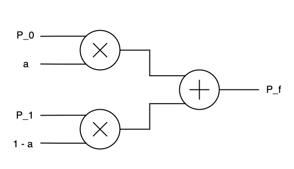
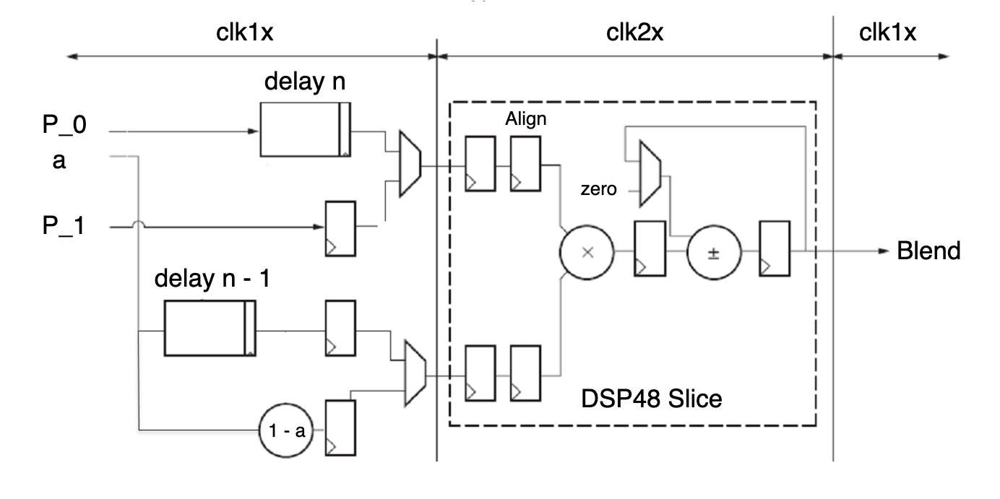

# CSUN ECE 524L Fall 2021
## Lab 3 - FPGA Features Clock Management, DSP Blocks, DDR, and SRL

**Report Created by:**
- Group 2
- Morris Blaustein
- Joseph Barchanowicz
- Karl Garcia

**Submission date:** 10/05/2021

## Introduction
Our goal for this lab is to learn how to use several FPGA features such as clock management components, block memories, distributed memory, DSP blocks, SRL components, and DDR. We will be designing a stream interleaver that mixes two streams of data along with their multiplier coefficients using several FPGA features. Different variations of the design will be implemented. A weighting factor defining the percentage of each data stream in the combined output data, can be used for this lab. For two input pixels, P0, P1, and a factor, α, where 0 ≤ α ≤ 1.0, the output Pf will be:
```
P_f = a * P_0 + (1 - a) * P_1
```
There are several configuration options for implementing this functionality. In this lab we will be using direct implementation, optomized implementation, as well as equalizing delays.

## Pre-Lab
-

## Procedure
### Part I
**Direct Implementation:**  We used a simple VHDL concurrent statement to directly implement the arithmetic expression for the output equation (P_f). The twho data streams P_0 and P_1 can represent two signal streams that can be interleaved. Figure 3.1 shows a straightforward implementation of this Interleaver. Figure 3.1 shows that the signal stream 0 consists of P_0 and alpha inputs. They are multiplied together and similarly, signal stream 1 consists of inputs P_1 and (1 – a) that are multiplied together and output are then added together.

  
Figure 3.1 Direct Implementation Block Diagram  

### Part II
**Optimized Implementation:** The first implementation can be made into a more optimized implementation. This can only happen if the multiplicationa and addition can be clocked to be twice faster than the other parts of the design. A digital clock manager (DCM) provides a phase-aligned double-frequency clock using the clk2x output. Figure 3.2 shows this implementation.


Figure 3.2 Suggested block diagram of the proposed interleaver  

### Part III

**Equalizing delays:** In most cases the two signal streams shown on Figure 3.1 and 3.2 are not synchronized. There will more than likely be a delay on one of the streams. In order to make up for this delay, SRL components can be used to source the signals or blend factors. For this delay we will use an SRL component. Figure 3.3 shows the addition of the delay component to the design to synchronize two data streams. 




Figure 3.3 Suggested block diagram of the proposed interleaver including delay components

## Testing Strategy  
### Part I
**Direct Implementation:** Our testing strategy for the direct implementation was to first write VHDL code to implement the circuit shown in Figure 3.1. In order to verify the design, we applied two sine waves on P0 and P1 with different amplitudes. We then changed the alpha value from 0 to 1. The blend made the transition from P0 to P1 waveform as shown in figure 3.4.


Figure 3.4 Simulated Waveform Direct Implementation 

**Question 1:** Implement the design. What is the resource utilization of the design? Figure 3.13 in the resource section shows the resources that were used in this design without using forced DSP blocks: 139 LUT's, 66 flip flops, and 0 DSP's.

**Question 2:** Have multipliers and adder been mapped to the DSP block? If not, can you force the tool to map these components to the DSP blocks? How do you prove your answers? They have not been mapped to any DSP blocks, but you can force the DSP blocks by using the two attribute lines of code:   
```vhdl
attribute use_dsp: string;                   
attribute use_dsp of p_f: signal is "yes";  
```
We can prove this by running synthesis and implementation again and checking the resources as shown in figure 3.14 in the resource section shows the resources that were used in this design with using forced DSP blocks: 8 LUT's, 17 flip flops, and 2 DSP's. 

### Part II

**Optimized Implementation:**  Our testing strategy for the optimized implementation, is there are two clock domains in this design. We then instantiate the clock manager module with 80 MHz clock input and deskewed output and use the clk2x output of the clock manager to generate 160 MHz clock for our DSP block. We then wrote complete VHDL code to infer all blocks (other than DCM).


Figure 3.5 Simulated Waveform Optimized Implementation

**Question 3:** Implement the design. What is the resource utilization of the design?  Figure 3.15 in the resource section shows the resources that were used in this design: 25 LUT's, 50 flip flops, and 2 DSP's.

**Question 4:** Have multipliers and adder been mapped to the DSP block? They were not, we still had to use the same attibute code from part 1.

### Part III
**Equalizing delays:**   In the third part of the lab, we applied a 64 clock cycle delay to the P_0 stream using SRL components according to Figure 3.3. 


Figure 3.6 Simulated Waveform Equalizing Delays

**Question 5:** Implement the design. What is the resource utilization of the design? Figure 3.16 in the resource section shows the resources that were used in this design: 29 LUT's, 66 flip flops, and 2 DSP's.

## Results (Data)

Figure 3.7 Direct Implementation Schematic without Forced DSP


Figure 3.8 Direct Implementation Schematic with Forced DSP


Figure 3.9 Optimized Implementation RTL Schematic


Figure 3.10 Optimized Implementation Implemented Schematic


Figure 3.11 Equalizing Delays RTL Schematic


Figure 3.12 Equalizing Delays Implemented Schematic

## FPGA Resources

Figure 3.13 Direct Implementation Resource without Forced DSP


Figure 3.14 Direct Implementation Resource with Forced DSP


Figure 3.15 Optimized Implementation Resources


Figure 3.16 Equalizing Delays Resources


## Conclusion
By performing this experiment, we were able to accomplish our goals to learn the use of several FPGA features such as clock management components, block memories, distributed memory, DSP blocks, SRL components, and DDR. We used three configurations for the design used in this lab: direct implementation, optimized implementation, and equalized delays. We designed and wrote code for the three configurations in order and before moving on to the next configuration, we tested the current one by simulating the testbench we wrote for each configuration. After testing each configuration and confirming our design was successful, we observed the resource utilization of each design. There were no problems encountered for this lab. 

-------------
-------------
Change the following question to yes when you are done with this assignment.  
The instructor will use this question to determine if your assignment is ready for review.  
# Is assignment ready for review? Yes
