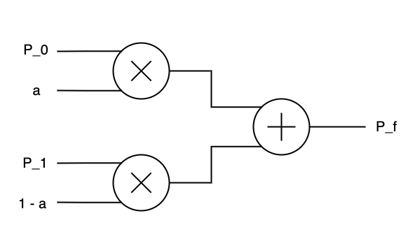
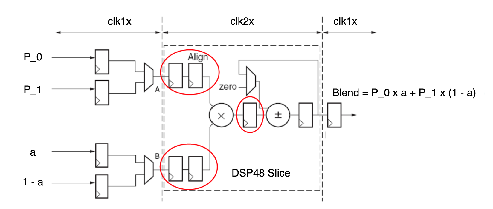
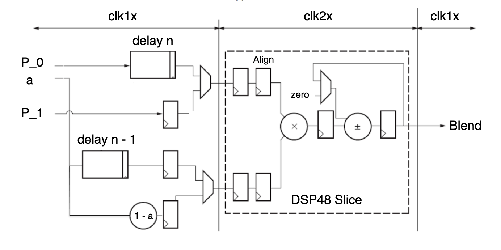

# ECE 524L Fall 2021
**California State University, Northridge**  
**Department of Electrical and Computer Engineering**  

# Lab 3 - Lab 3 FPAG Features Clock Management, DSP Blocks, DDR, and SRL


## Objective

After completing this lab, students will be able to:
- Use several FPGA features such as clock management components, block memories, distributed memory, DSP blocks, SRL components, DDR


## Requirements

The following material is required to complete the lab:
- Xilinx Vivado 2019.1

## References

- Xilinx FPGA datasheets (available at http://www.xilinx.com)
- Software Manual (available at http://www.support.xilinx.com)

## Introduction

In this lab you are going to design a stream interleaver that mixes two streams of data along with their multiplier coefficients using several FPGA features. You will implement different variations of this design in this lab. Mixing two data streams into a single combined stream has several application in video and audio processing such as: fading between two images; making a transition band between two images on a split-screen. A weighting factor defining the percentage of each data stream in the combined output data, can be used. For two input pixels, P0, P1, and a factor, α, where 0 ≤ α ≤ 1.0, the output Pf will be:
 
```
P_f = a * P_0 + (1 - a) * P_1
```

There are several configuration options for implementing this functionality. 

### Part I

**Direct Implementation:** Simple VHDL concurrent statement can be written to directly implement the arithmetic expression for output equation (P_f). Data streams P_0 and P_1 can represent two signal streams that can be blended. Figure 3.1 shows a straightforward implementation of this blender. In Figure 3.1, signal stream 0 consists of P_0 and alpha inputs. They are multiplied together and similarly, signal stream 1 consists of inputs P_1 and (1 – a) that are multiplied together and output the products are added together. The output of each arithmetic block (multipliers and adders) must be registered for this implementation to maximize performance.



Figure 3.1 Signal stream blender high level block diagram

:point_right: **Task 1:** Write VHDL code to implement the circuit shown in Figure 3.1. In order to verify the design, you can apply two sine waves on P0 and P1 with different amplitude. Change alpha value from 0 to 1. The blend output should make transition from P0 to P1 waveform. You should test your design for several cases in order to prove the correct functionality. For instance, case of a = 1 or a = 0 to show the output shows either one of the waveforms. A more interesting simulation case should be included to prove the functionality for a linear transition of alpha from 0 to 1.  Assume P_0 and P_1 are 8 bit values and 0 <= a <= 1. Prove that your design is working by providing the simulation.

:question: **Question 1:** Implement the design. What is the resource utilization of the design? 

:question: **Question 2:** Have multipliers and adder been mapped to the DSP block? If not, can you force the tool to map these components to the DSP blocks? How do you prove your answers? 


### Part II

**Optimized Implementation:** The first implementation probably uses 3 DSP blocks (or adders/multipliers) but it can be converted to a more optimized implementation. This can only happen if the arithmetic engine (DSP block) can be clocked twice faster compared to the other parts of the design. A digital clock manager (DCM) provides a phase-aligned double-frequency clock using the clk2x output. Figure 3.2 shows this implementation.

There are two clock domains: the clk1x domain, at the nominal data stream frequency, and the
clk2x domain, at twice the nominal frequency. Figure 3.2 shows registers before/after the multiplier. These registers are required to achieve the full, pipelined performance at very high speed. These registers are free since they are built into the DSP slices but for this implementation, they can be omitted. 

The operating mode of the adder alternates between add 0 (pass through) mode and add output (accumulate) mode. The DSP slice output register contains the result of the P0 × alpha multiply during one clock cycle, and the final result, `P_1 * (1 – a) + P_0 * a`, on the alternate clock. The final output register for blend loads new data every other DSP clock to register the blend results.



Figure 3.2 Suggested block diagram of the proposed interleaver


:point_right: **Task 2:** For the optimized implementation, there are two clock domains in this design. Instantiate the clock manager module with 50 MHz clock input and deskewed output and use the clk2x output of the clock manager to generate 100 MHz clock for your DSP block. Write complete VHDL code to infer all blocks (other than DCM). Prove that your design is working by providing the simulation. You can use the testbench you developed in the first part of the lab. 

:question: **Question 3:** Implement the design. What is the resource utilization of the design? 

:question: **Question 4:** Have multipliers and adder been mapped to the DSP block? If not, can you force the tool to map these components to the DSP blocks? How do you prove your answers? 


### Part III

Equalizing delays: In general two signal streams shown on Figure 3.1 are not completely synchronized. Most of the time there is a delay on one of the streams. In order to compensate for this delay, SRL components can be used to source the signals or blend factors. For long delays BRAMs are more efficient while for short delays SRL components are more efficient. Figure 3.3 shows the addition of the delay component to the design to synchronize two data streams. DDR (Double Data Rate) registers, as used in this lab, refers to multiplexing two input data streams into one stream at twice the rate and interleaving (in time) the data from each stream as shown in Figure 3.3.




Figure 3.3 Suggested block diagram of the proposed interleaver including delay components


:point_right: **Task 3:** In the third part of the lab, apply 64 clock cycle delay to P_0 stream using SRL components according to Figure 3.3. You can use IP Integrator to generate the SRL components. The testbench developed in the first part of the lab should be slightly modified so you can apply it to the third part of the lab. Provide the simulation waveform to prove your design is functioning.

:question: **Question 5:** Implement the design. What is the resource utilization of the design? 
